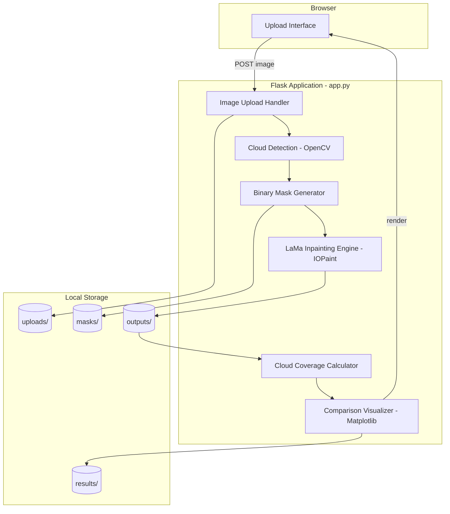
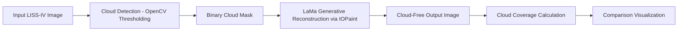

# ClearSky — Generative AI Cloud Removal for LISS-IV Satellite Imagery

[](https://www.python.org/)
[](https://flask.palletsprojects.com/)
[-orange.svg)](https://github.com/Sanster/IOPaint)
[](LICENSE)
[]()

A prototype pipeline for detecting cloud-covered regions in LISS-IV optical satellite imagery and reconstructing them using generative inpainting (LaMa, served through IOPaint). Built for the Bharatiya Antariksha Hackathon.

---

## Overview

Cloud cover is one of the most persistent obstacles in optical remote sensing. It blocks land features, interrupts time-series analysis, and limits the usability of satellite imagery for agriculture, disaster response, and urban monitoring.

This project detects cloud-affected regions in LISS-IV imagery and reconstructs the obscured areas using the LaMa (Large Mask Inpainting) generative model. It is a working prototype that demonstrates the full pipeline — detection, masking, generative reconstruction, and evaluation — and is built to be extended into a more rigorous remote sensing system. The current scope and its limitations are described explicitly below so the prototype isn't mistaken for a validated production model.

## Table of Contents

- [Architecture](#architecture)
- [Pipeline](#pipeline)
- [Features](#features)
- [Screenshots](#screenshots)
- [Tech Stack](#tech-stack)
- [Installation](#installation)
- [Usage](#usage)
- [Folder Structure](#folder-structure)
- [Limitations](#limitations)
- [Future Work](#future-work)
- [Acknowledgements](#acknowledgements)
- [License](#license)

## Architecture



## Pipeline



## Features

- Upload satellite imagery through a web interface
- Automatic cloud mask generation using threshold-based detection
- Automatic cloud reconstruction using the LaMa generative model via IOPaint
- Side-by-side display of original image, mask, and reconstructed output
- Cloud coverage percentage calculation
- Output image saving
- Auto-generated comparison figure

## Screenshots

Add screenshots here before submission. Replace the placeholders below with actual images saved in `assets/`.

| Original Image | Cloud Mask | Reconstructed Output |
|---|---|---|
|  |  |  |

A short screen recording of the application in use can also be added:

```markdown

```

## Tech Stack

| Component | Technology |
|---|---|
| Backend | Flask (Python 3.12) |
| Image Processing | OpenCV, NumPy, Pillow |
| Generative Reconstruction | LaMa (Large Mask Inpainting) via IOPaint |
| Visualization | Matplotlib |
| Frontend | HTML (Jinja2 templates) |
| Environment | Python venv, Ubuntu 24.04 |

## Installation

```bash
# Clone the repository
git clone https://github.com/<your-username>/<repo-name>.git
cd <repo-name>

# Create and activate a virtual environment
python3 -m venv venv
source venv/bin/activate        # On Windows: venv\Scripts\activate

# Install dependencies
pip install -r requirements.txt
```

IOPaint downloads the LaMa model weights automatically on first run. Requirements: Python 3.12, a Linux/macOS/WSL environment, and approximately 2 GB of free disk space for model weights.

## Usage

```bash
source venv/bin/activate
python app.py
```

Then open a browser at `http://127.0.0.1:5000`.

1. Upload a LISS-IV (or other optical satellite) image.
2. The application detects cloud regions and generates a binary mask.
3. The masked region is reconstructed using LaMa via IOPaint.
4. The original image, mask, reconstructed output, and cloud coverage percentage are displayed.
5. The comparison visualization and output image are saved automatically.

## Folder Structure

```text
cloud_removal/
│
├── app.py                  # Flask application entry point
├── requirements.txt        # Python dependencies
├── README.md
├── LICENSE
├── .gitignore
│
├── templates/
│   └── index.html          # Upload interface
│
├── assets/                 # Screenshots, diagrams, demo files for README
│
├── uploads/                # User-uploaded images (excluded from version control)
├── masks/                  # Generated cloud masks (excluded)
├── outputs/                # Reconstructed output images (excluded)
├── results/                # Comparison visualizations (excluded)
├── real_images/            # Sample/test images (keep a few curated samples)
├── temp_images/            # Runtime temporary files (excluded)
└── temp_masks/             # Runtime temporary files (excluded)
```

Runtime-generated directories (`uploads/`, `masks/`, `outputs/`, `results/`, `temp_images/`, `temp_masks/`) are excluded from version control via `.gitignore`, with `.gitkeep` placeholders used to preserve the folder structure. Downloaded LaMa/IOPaint model weights are also excluded, since they are fetched automatically on first run.

## Limitations

This is a hackathon prototype, not a validated remote sensing product:

- Cloud detection is threshold-based (OpenCV), not a trained segmentation model, and can misclassify bright land features such as snow, sand, or rooftops as clouds.
- Reconstruction uses a general-purpose image inpainting model (LaMa), not one trained specifically on multispectral or SAR remote sensing data, so it does not guarantee physically accurate spectral reconstruction over land cover.
- No quantitative accuracy evaluation (PSNR, SSIM, SAM) has been performed yet.
- The pipeline handles single-temporal, single-sensor (LISS-IV) input only, with no multi-temporal or SAR fusion.

## Future Work

- Replace threshold-based detection with a trained U-Net cloud segmentation model
- Integrate Sentinel-1 SAR data for cloud-independent reconstruction cues
- Add multi-temporal image fusion to reconstruct using prior cloud-free observations
- Train or fine-tune on the SEN12MS-CR dataset for domain-specific reconstruction
- Explore diffusion-based generative reconstruction models
- Add quantitative evaluation using PSNR, SSIM, and SAM metrics
- Containerize the application with Docker for easier deployment
- Add REST API endpoints for batch processing

## Acknowledgements

- [IOPaint](https://github.com/Sanster/IOPaint) for the inpainting framework and model serving
- LaMa: Resolution-robust Large Mask Inpainting with Fourier Convolutions (Suvorov et al.)
- Bharatiya Antariksha Hackathon organizers for the LISS-IV imagery context and challenge problem statement
- The OpenCV and broader open-source geospatial and computer vision community

## License

This project is licensed under the [MIT License](LICENSE).

## Author

Developed by Dhanush as part of a submission to the Bharatiya Antariksha Hackathon. Issues and pull requests are welcome.
